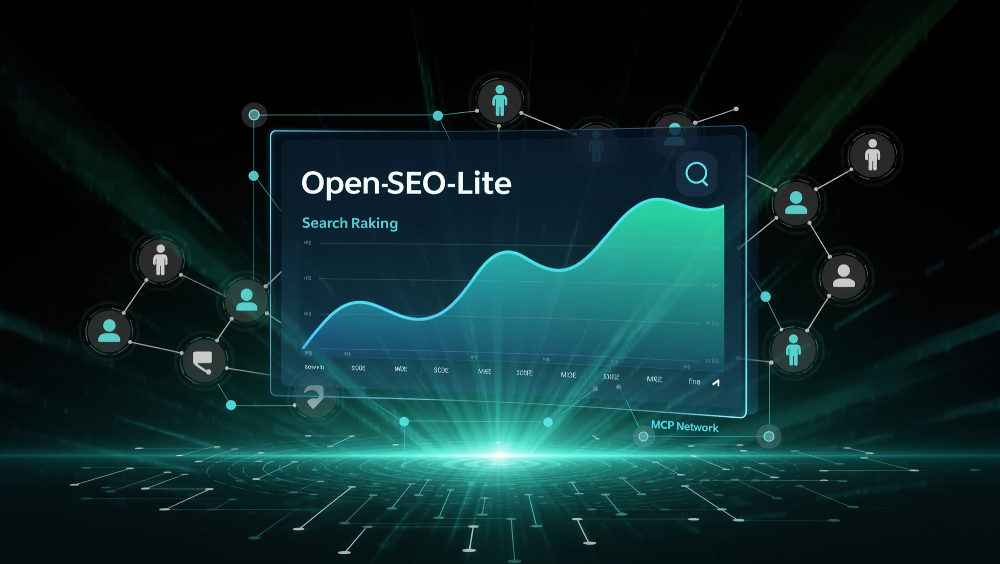

# OpenSEO-Lite Agent

<p align="center">
  
</p>

<p align="center">
  
</p>

<p align="center">
  <strong>Check rankings. Audit a page. See if AI mentions your brand.</strong><br/>
  Four MCP tools for Claude, Cursor, Hermes, and Grok.<br/>
  <em>No Docker · No database · Pip install · MIT</em>
</p>

<p align="center">
  <a href="https://github.com/Nagacash/-OpenSEO-Lite"></a>
  <a href="https://modelcontextprotocol.io/"></a>
  <a href="LICENSE"></a>
</p>

> **Designed by [Naga Codex](https://www.nagacodex.cloud/)**

## Why OpenSEO-Lite?

Enterprise SEO suites are heavy, expensive, and dashboard-first.  
**OpenSEO-Lite is agent-first:** four sharp tools your LLM can call to scrape SERPs, audit pages, score sites, and check AI visibility — then return structured JSON and a 3-step action plan.

| Skill | What it does |
|---|---|
| `serp_search` | Live organic Google rankings by keyword + region |
| `page_audit` | Titles, headings, links, thin-content flags |
| `site_audit` | 0–100 health score + prioritized fixes |
| `ai_visibility_check` | Are answer engines mentioning & citing your brand? |

<p align="center">
  
</p>

---

## Deploy (Vercel)

The web playground (UI + `/api/skills/*`) can deploy to Vercel from this repo.

1. Go to [vercel.com/new](https://vercel.com/new) → Import `Nagacash/-OpenSEO-Lite`
2. Framework: **Other** (uses `vercel.json`)
3. Build: `npm run build` · Output: `dist`
4. Deploy

Optional env vars in Vercel: `GEMINI_API_KEY`, `OPENROUTER_API_KEY`, `LLM_PROVIDER`, `LLM_MODEL`.

**Note:** The Python MCP server (`mcp_server.py`) is for local Claude/Cursor agents — it does not run on Vercel. Use the playground API on Vercel; run MCP locally with `python mcp_server.py`.

Local production check:
```bash
npm run build
NODE_ENV=production npm start
# open http://localhost:3000
```

---

## Quick Start (3-step setup)

### Step 1: Clone and install dependencies
```bash
git clone https://github.com/Nagacash/-OpenSEO-Lite.git
cd -OpenSEO-Lite
# or: cd OpenSEO-Lite  (depending on how git names the folder)

# Install dependencies (Python 3.11+ recommended)
pip install -r requirements.txt

# Install Playwright browser binaries (one-time setup for browser automation)
playwright install chromium
```

### Step 2: Set your environment variables
```bash
# Option A: OpenRouter (Supports 100% FREE models like Llama 3.3 70B & Mistral!)
export OPENROUTER_API_KEY="sk-or-v1-..."
export LLM_PROVIDER="openrouter"
export LLM_MODEL="meta-llama/llama-3.3-70b-instruct:free"

# Option B: NVIDIA NIM (Free cloud tier credits for Llama 3 70B & Nemotron)
export NVIDIA_API_KEY="nvapi-..."
export LLM_PROVIDER="nvidia"
export LLM_MODEL="google/gemma-4-31b-it"

# Option C: OpenAI / Anthropic / Gemini
export LLM_API_KEY="your-api-key-here"

# (Optional) configure MCP server port if using SSE transport
export PORT=8000
```

### Step 3: Launch the MCP Server
```bash
# Stdio transport (recommended for Claude Desktop & Cursor)
python mcp_server.py

# Or run SSE HTTP server on localhost:8000
python mcp_server.py --transport sse --port 8000
```

---

## Environment Variables

| Variable | Description | Required | Default |
|---|---|---|---|
| `OPENROUTER_API_KEY` | OpenRouter API Key (use free models like Llama 3.3 70B Free) | Optional | Auto-detected from `sk-or-` |
| `NVIDIA_API_KEY` | NVIDIA NIM API Key (fast cloud inference) | Optional | Auto-detected from `nvapi-` |
| `LLM_API_KEY` | Generic LLM Key (OpenAI, Anthropic, Gemini) | Optional | Rule-based fallback if omitted |
| `LLM_PROVIDER` | Provider selector (`openrouter`, `nvidia`, `openai`, `anthropic`, `gemini`) | Optional | Auto-detected from key prefix |
| `LLM_MODEL` | Custom model ID (e.g. `meta-llama/llama-3.3-70b-instruct:free`) | Optional | Sensible default per provider |
| `PORT` | Port for MCP SSE server | Optional | `8000` |
| `HOST` | Host binding for MCP server | Optional | `127.0.0.1` |

---

## Connecting Your AI Agent (MCP Setup)

OpenSEO-Lite runs standard MCP. You can plug it into Claude, Grok bots, Hermes Agent, Cursor, or any agent framework in under a minute.

### 1. Claude Desktop
Add this to your `claude_desktop_config.json`:
- **Mac**: `~/Library/Application Support/Claude/claude_desktop_config.json`
- **Windows**: `%APPDATA%\Claude\claude_desktop_config.json`

```json
{
  "mcpServers": {
    "openseo-lite": {
      "command": "python",
      "args": ["/ABSOLUTE/PATH/TO/openseo-lite/mcp_server.py"],
      "env": {
        "LLM_API_KEY": "your-api-key-here"
      }
    }
  }
}
```

### 2. Hermes Agent (Nous Research / Open Source LLMs)
Hermes agents connect via local SSE or direct Python tools:
```bash
# Option A: Start OpenSEO-Lite on local port 8000
python mcp_server.py --transport sse --port 8000
```
In your Hermes configuration (`agent_config.yaml` or tool connector):
```yaml
mcp_servers:
  - name: openseo-lite
    url: http://localhost:8000/sse
```
*Hermes will automatically detect the 4 skills (`serp_search`, `page_audit`, `site_audit`, `ai_visibility_check`) and invoke them when you ask SEO questions.*

### 3. Grok Bot / xAI Agents
For Grok bots or xAI API tool-use wrappers, you can run OpenSEO-Lite as a local tool provider:
```python
# In your Grok / xAI tool loop
from skills import serp_search, page_audit, site_audit, ai_visibility_check

tools = [
    {"type": "function", "function": {"name": "serp_search", "description": "Search Google and get top organic rankings", "parameters": {"type": "object", "properties": {"keyword": {"type": "string"}}, "required": ["keyword"]}}},
    {"type": "function", "function": {"name": "page_audit", "description": "Check on-page SEO issues like titles, headings, and links", "parameters": {"type": "object", "properties": {"url": {"type": "string"}}, "required": ["url"]}}},
    {"type": "function", "function": {"name": "site_audit", "description": "Get a full 0-100 SEO score with top 3 fixes", "parameters": {"type": "object", "properties": {"url": {"type": "string"}}, "required": ["url"]}}},
    {"type": "function", "function": {"name": "ai_visibility_check", "description": "Score brand mention/citation visibility in AI/SERP surfaces", "parameters": {"type": "object", "properties": {"brand": {"type": "string"}, "domain": {"type": "string"}}, "required": ["brand", "domain"]}}}
]
```
Or simply connect your Grok agent runtime to `http://localhost:8000/sse`.

### 4. Cursor & Windsurf
- **Cursor**: Open **Settings → Features → MCP → + Add New MCP Server**.
  - Type: `command`
  - Command: `python /path/to/openseo-lite/mcp_server.py`
- **Windsurf**: Add to `~/.codeium/windsurf/mcp_config.json` under `mcpServers`.

---

## Example Workflows

### Workflow 1: "Audit my homepage"
Ask your AI Agent in Claude or Cursor:
> *"Please audit my landing page at https://mysite.io using openseo-lite. Tell me what my score is and the top 3 things to fix today."*

**Agent Execution:**
1. Calls `site_audit(url="https://mysite.io")`
2. Evaluates page status, title length, missing H1, thin copy, and internal links
3. Returns score (e.g. `78/100`), structured issues, and prioritized 3-step action checklist.

### Workflow 2: "Check Google SERP rankings for competitor research"
Ask your AI Agent:
> *"Search Google for 'best ai code editor' in the US and tell me what domains rank in the top 5."*

**Agent Execution:**
1. Calls `serp_search(keyword="best ai code editor", location="us")`
2. Navigates Google SERP, extracts organic results, filters ads
3. Returns position, title, URL, and snippet for each competitor.

### Workflow 3: "Technical on-page comparison"
Ask your AI Agent:
> *"Run a page audit on both https://mysite.io and https://competitor.com/blog and compare their word counts and heading structure."*

**Agent Execution:**
1. Calls `page_audit` on both URLs
2. Compares semantic headings (`h1`, `h2`, `h3`), word counts, and metadata tags
3. Synthesizes an on-page gap analysis.

---

## Built with

- [](https://playwright.dev/) — Headless Chromium for SERP + page fetches
- [](https://modelcontextprotocol.io/) — Official Model Context Protocol
- [](https://openrouter.ai/) — Free LLM inference (Llama 3.3 70B Free)
- [](https://build.nvidia.com/) — Free GPU cloud inference
- [](https://github.com/pmndrs/zustand) — Safe client-side local storage with zero-telemetry

---

## CLI Interface & Exporting

OpenSEO-Lite includes a full CLI to run audits and export reports:

```bash
# Run site audit and print to terminal
python cli.py site_audit --url="https://example.com"

# Export report to clean JSON / Markdown
python cli.py site_audit --url="https://example.com" --export=json
python cli.py site_audit --url="https://example.com" --export=md

# Quick Google rank check
python cli.py serp_search --keyword="best ai code editor" --location="us" --export=json

# Page audit export
python cli.py page_audit --url="https://example.com" --export=json

# AI visibility (demo fixtures by default; add --live for SERP probes)
python cli.py ai_visibility_check --brand="Acme" --domain="acme.com"
python cli.py ai_visibility_check --brand="Acme" --domain="acme.com" --live --export=md
```

---

## Example Agent Workflows

### Keyword Research Workflow
1. Run `serp_search(keyword="seed keyword", location="us")`
2. Run `page_audit` on top 3 ranked competitor URLs
3. Ask your AI agent: *"Based on these 3 competitors' titles, headings, and word counts, what 10 keywords and semantic topics should I target?"*

### Competitor Gap Analysis Workflow
1. Run `serp_search` for 3 of your primary business keywords
2. Run `site_audit` on your URL and the #1 ranking competitor's homepage
3. Ask your agent: *"What are my competitors doing better? Give me 5 immediate action items to close the gap."*

### AI Visibility Workflow
1. Run `ai_visibility_check(brand="YourBrand", domain="yourbrand.com")`
2. Review `visibility_score` and per-query mention/citation evidence
3. Ask your agent: *"Draft the FAQ and comparison pages I need to improve AI citation rate."*

### Suggested Topics Workflow (heuristic)
1. Run `site_audit(url="https://mysite.io")`
2. Review `suggested_topics` (heuristic topic ideas from page copy — not live #11–20 ranks)
3. Validate promising topics with `serp_search` before investing content effort.

---

## Roadmap

### v0.1 (Current)
- [x] 4 core skills (`serp_search`, `page_audit`, `site_audit`, `ai_visibility_check`)
- [x] FastMCP server + Playwright browser automation
- [x] Heuristic estimated CWV + suggested topics (honestly labeled)
- [x] CLI interface (`cli.py`) with JSON & Markdown export for all skills
- [x] Zero-database, zero-telemetry Zustand local storage
- [x] OWASP Top 10 SSRF protection & security hardening
- [x] Ready-to-use Agent system prompts (Hermes, Grok, Claude, Cursor)

### v0.2 (Next 2 weeks)
- [ ] Live CrUX API (optional key) replacing heuristics
- [ ] Real striking-distance via multi-keyword `serp_search`
- [ ] Google Search Console (GSC) OAuth API sync
- [ ] MCP Registry official submission

### v1.0 (Next month)
- [ ] Scheduled recurring rank tracking (local file store)
- [ ] Export to PDF formatted reports
- [ ] Multi-page automated crawler with site-wide graph visualization

---

## Running the Tests
To verify all 4 skills return strict JSON:
```bash
python tests/test_skills.py
```

---

## Cybersecurity & OWASP Top 10 Hardening

OpenSEO-Lite implements strict defensive security and scraping compliance:

1. **SSRF Protection (OWASP A10:2021)**:
   - Evaluates all audit URL requests.
   - Prohibits loopback hosts (`127.0.0.1`, `localhost`, `::1`), cloud metadata IPs (`169.254.169.254`, `metadata.google.internal`), and RFC 1918 private subnets (`10.0.0.0/8`, `172.16.0.0/12`, `192.168.0.0/16`).
2. **Client-Side Safe Secrets (Zustand LocalStorage)**:
   - API keys are managed client-side and never saved to a centralized database.
3. **OWASP Defensive Headers**:
   - `X-Content-Type-Options: nosniff`, `X-Frame-Options: SAMEORIGIN`, and strict referrer policy.
4. **Anti-Strike Scraping Ethics**:
   - 15-second execution abort timeouts, natural user agents, and user-initiated runs only.

---

## Ready-to-Use Agent System Prompt (for Hermes, Grok, Claude)

Copy and paste this system prompt into your AI agent runtime:

```markdown
You are an autonomous reasoning AI agent equipped with the OpenSEO-Lite MCP toolkit for technical SEO and SERP analysis.

### YOUR MCP TOOLS
1. serp_search(keyword: str, location?: str): Real-time Google organic results (ad-free).
2. page_audit(url: str): Extracts title, meta description, H1/H2/H3 semantic structure, word count, internal/external links, and detects technical flags.
3. site_audit(url: str): Computes a 0-100 SEO health score, classifies issue severities, and produces an executive summary with a 3-step prioritized action plan. estimated_cwv / suggested_topics are heuristics.
4. ai_visibility_check(brand: str, domain: str, live?: bool): Brand mention/citation visibility score with per-query evidence.

### OPERATIONAL GUIDELINES
- When asked to audit a website, call site_audit first.
- When asked about AI answer visibility, call ai_visibility_check.
- Ground all advice strictly in returned JSON metrics without hallucinating rankings.
- Provide crisp executive summaries followed by exactly 3 prioritized high-impact actions.
```